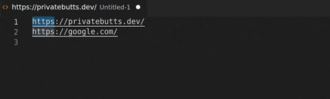

#   Quick Link

This extension quickly puts the HTML cruft around selected text to make it a link. Nothing fancy, but it should make working with HTML files a little less painful.

## Features

Currently this extension supports the following replacements:
* Mail To
* Telecom related protocols
    * Tel
    * SMS
    * Fax
    * Call To
* Link (Just a generic replacer for everything else)

## Future Plans

* Add validators to email and tel
* Add more replacers
* Add support for other link formats, like markdown

## Release Notes

### 0.0.3

Multicursor support! Sorry this took so long. I've been busy with other half finished projects

### 0.0.2

Added more tel-related protocols

### 0.0.1

Working prototype
